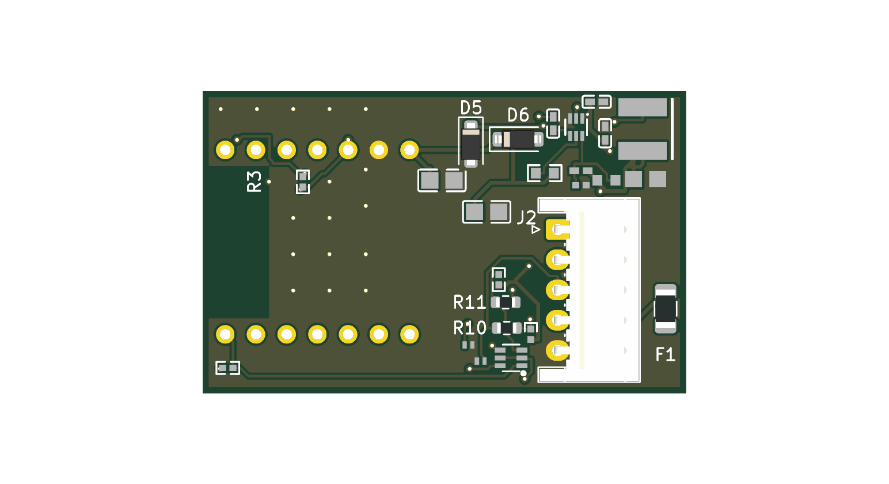
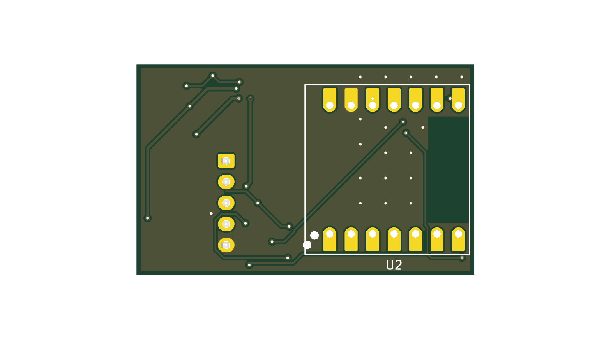
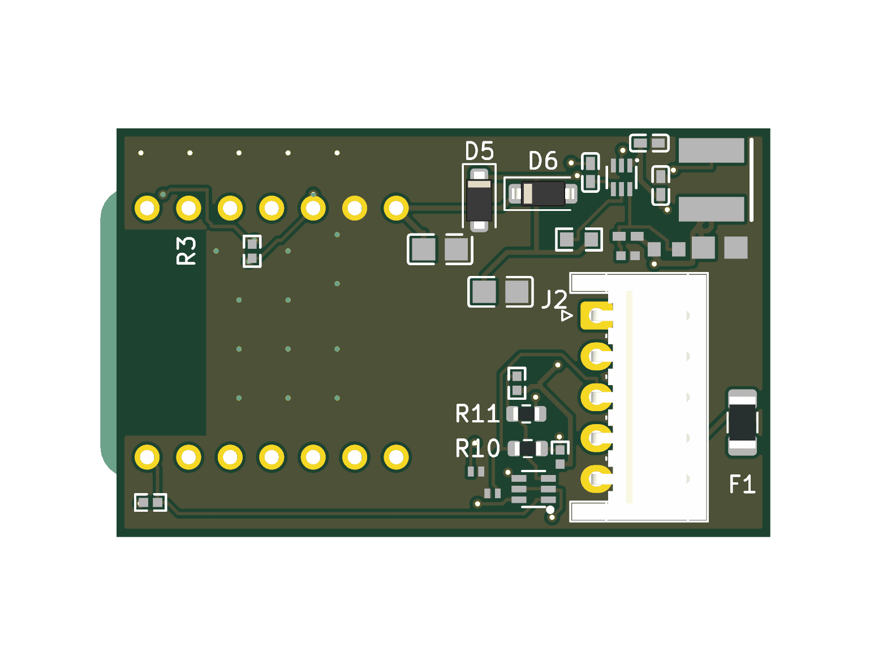
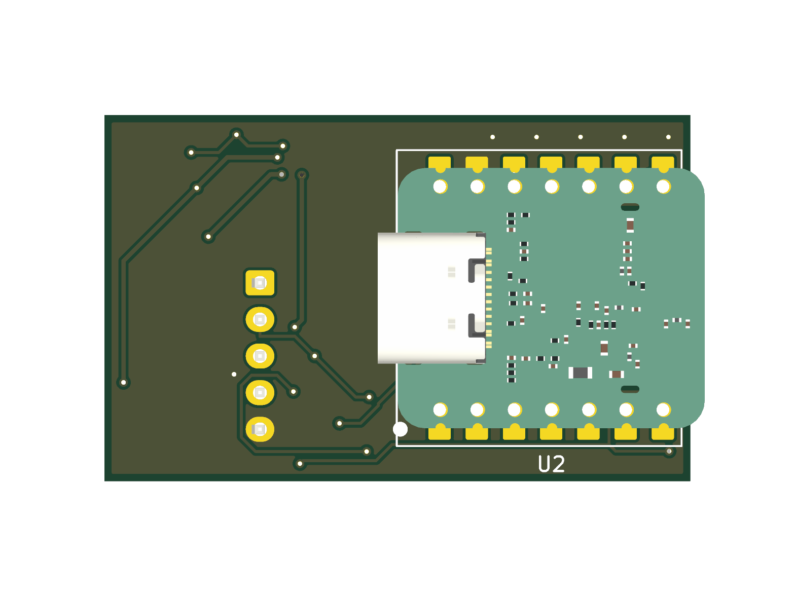
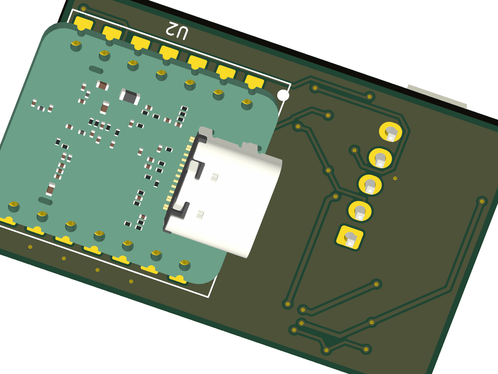

> Review copy for the public fork. Canonical source: faikin32 docs/xiao-carrier-verification.md (private repo).

# XIAO ESP32-C6 carrier verification record

Records the completed XIAO ESP32-C6 carrier board for the Daikin S21 bus (Zigbee
thermostat bridge). The carrier hosts a purchased Seeed XIAO ESP32-C6 module on a
2-layer PCB that rebuilds the validated non-inverting 5V front-end from the rev-b
work, this time around a socketed/soldered module instead of a consigned WT0132C6-S5.
Design + plan: `.superpowers/sdd/` in the fork; pivot rationale in memory note
`faikin32-xiao-carrier-pivot`.

All board work is on branch `xiao-carrier` in the fork at
`E:\projects\ESP-Matter-Daikin-S21`; fab package HEAD `659e553`.
KiCad 10.0.4. Every task was implemented by a subagent and reviewed by a separate
subagent; the routed board passed a delegated PCB/DFM review (trusted tier,
kicad-cli 10.0.4 + pcbnew geometry extraction).

## Verdict

The carrier is fab-ready (OSH Park or JLCPCB 2-layer). The delegated DFM review
returned READY-WITH-FIXES; both required cleanups were applied before gerber export
(via dedupe and the dangling /5V_BUCK stub deletion). Final DRC, both at the
JLCPCB-conservative committed rules and re-run at OSH Park's 6-mil (0.1524 mm)
capability floor:

- Gating DRC (`verification/xiao-task8-drc.json`): 0 errors, 0 unconnected, 0 parity.
- OSH Park 6-mil DRC (`verification/xiao-task8-6mil-drc.json` + method note): 0 errors,
  0 unconnected, 0 parity.

ERC is clean on the schematic (0 errors). The board routes 15/15 nets.

## Board

- Size: 40.1 x 25.1 mm (Edge.Cuts bounding box 40.0 x 25.0 mm; the extra 0.1 mm is the
  module antenna arc overhang at the north edge).
- Layers: 2 (F.Cu / B.Cu), 1 oz copper.
- Min trace width: 0.20 mm signal, 0.30 mm power (buck + input). IPC-2152 margins are
  large for the 0.5 A / 5 V rail and the fused 12 V input.
- Min clearance: routed board passes at 0.1524 mm (OSH Park 6-mil); committed rules are
  JLCPCB-conservative (0.20 mm track-to-pad).
- Min drill: 0.30 mm (via), 0.889 mm (PTH). Annular ring 0.15 mm. All above OSH Park and
  JLCPCB floors.
- Copper pour: GND on both layers, 17 stitch vias for the 2.4 GHz return path.
- Solder-mask web: minimum-web DRC enforcement enabled (`solder_mask_min_width` 0.1 mm,
  the OSH Park floor); DRC reports 0 solder_mask_bridge violations. The tightest same-net
  buck-feedback web (C19-R6, both `/5V_BUCK`) was opened from 0.10 mm to 0.25 mm and the
  GND-to-`/5V_BUCK` web (R8-R6) from 0.23 mm to 0.48 mm; smallest different-net cluster
  web is now 0.39 mm.

## Buck regulator (TPS562246, U1)

Adjustable-output synchronous step-down, Vref 0.6 V. Feedback divider set for 5.0 V:

- R6 (top, /5V_BUCK to VFB) = 220 k, R8 (bottom, VFB to GND) = 30 k, C19 (feedforward
  across R6) = 47 pF.
- Vout = Vref x (1 + R6/R8) = 0.6 x (1 + 220k/30k) = 0.6 x 8.3333 = 5.000 V.
- R5 (150 k) is the EN pull-up to V_in, not part of the divider.
- Feedback net verified from the exported netlist: `Net-(U1-VFB)` = {C19.1, R6.2, R8.1,
  U1.6(FB)}; no other node. The 5.0 V rail (`/5V_BUCK`) carries {C15.1, C19.2, D6.2(A),
  L1.2, R1.1, R12.1, R6.1}.

## Three-power-net topology

The board carries three independent power rails, verified by node-set from the netlist:

1. `/5V_BUCK`: the buck output (5.0 V), feeds the XIAO through D6.
2. `/VBUS`: the XIAO's USB VBUS pin (U2.14), decoupled by C20, D6 cathode.
3. `3V3`: the XIAO's own 3V3_OUT regulator pin (U2.12), which supplies the level-shifter
   reference and its pull-ups.

D6 (Schottky) isolates the buck from USB: anode on `/5V_BUCK`, cathode on `/VBUS`. Current
flows buck -> VBUS only; when a USB cable powers the XIAO, VBUS cannot backfeed the buck
output. Path D6.1 -> C20.1 -> U2.14 confirmed intact by the DFM review.

## S21 signal front-end

The S21 TX/RX lines from J2 (JST-EH) pass through series resistors (R10/R11, 220 R) and a
non-inverting level shifter (Q1 BSS138PS, dual N-channel) between the aircon's HV logic and
the XIAO's 3V3 UART. Each connector-side signal has a line-to-GND protection diode:

- D2: pin 2 on `/S21_TX_CONN` (J2.2, aircon-Tx, via R11), pin 1 on GND.
- D3: pin 2 on `/S21_RX_CONN` (J2.3, aircon-Rx, via R10), pin 1 on GND.

Both were blank in the schematic Value field and carried LCSC `C5137770` as their assigned
part. That LCSC number resolves to GOODWORK `ES05D1MC10`, a single-line bidirectional
ESD/TVS diode in DFN1006-2L: 5 V reverse stand-off, 5.6 V breakdown, 11 V clamp, 8 A / 80 W
peak pulse (LCSC product page, fetched). A 5 V bidirectional clamp to GND is the right choice
for the S21 signal lines. Their Value fields were set to `ESD 5V bidir` in this task, a
metadata-only edit with no wiring change.

The edit was verified: the exported netlist node-universe is byte-identical before and after
(36 nets, zero changed node-sets, no new single-pad net), ERC stays at 0 errors, and DRC
schematic-parity stays at 0. The change is committed on its own (`fix(xiao-sch): assign
D2/D3 sourceable values`).

## Bill of materials

Every SMD part carries an LCSC number and a web-verified DigiKey or Mouser equivalent. The
XIAO module (U2) is a purchased board, hand-placed / socketed, not machine-assembled: it is
marked **DNP by fab / hand-assembled** in the BOM. The full sourced BOM is
`Custom PCB esp32c6/BOM_xiao.csv` in the fork.

Verification corrected six part assignments the XIAO board inherited from rev-b, where the
value had changed but the LCSC number still pointed at the old rev-b part. These would have
mis-built the board (JLC and any regenerated BOM assemble by LCSC number). All are corrected
in both the schematic (commit `fix(xiao-sch): correct stale rev-b LCSC part numbers`) and the
BOM CSV, and each replacement was verified against its LCSC product page:

| Ref | Was (LCSC / actual part) | Now (LCSC / part) | Why |
|-----|--------------------------|-------------------|-----|
| R6 | C22807 = 150k | C22961 = 220k 1% 0603 (UNI-ROYAL) | Sets buck Vout; 150k gave the wrong voltage |
| R8 | C25779 = 33k | C138008 = 30k 1% 0402 (YAGEO) | Sets buck Vout; 33k gave the wrong voltage |
| C15 | C16780 = 47uF 6.3V | C2292827 = 47uF 10V X5R 0805 (Murata) | 6.3V fails the DC-bias floor at 5V (see below) |
| C19 | C1549 = 18pF | C84706 = 47pF C0G 0402 (Samsung) | Buck feedforward value |
| C17 | C45783 = 22uF 25V (obsolete) | C398931 = 22uF 25V X5R 0805 (Murata GRT) | In-stock replacement |
| D2/D3 | value blank | C5137770 = GOODWORK ES05D1MC10 (value set "ESD 5V bidir") | Was unlabeled |

C15 DC bias: the buck output cap must hold >= 15 uF effective at the 5.0 V rail. The 6.3 V
C16780 cannot (5 V is ~79% of rating, where a 6.3 V X5R has collapsed). The chosen 47 uF 10 V
X5R 0805 (Murata GRM21BR61A476ME15K) sits at 50% of its rating at 5 V and holds roughly
21-24 uF, comfortably above the floor. Evidence tier: estimate from 47 uF / 10 V X5R 0805
half-rated-bias behavior (~-50%); the Murata LCSC page does not print the curve, so confirm
against Murata SimSurfing at order time if a hard guarantee is needed. Confidence medium-high.

The full sourced BOM (every SMD part with LCSC number and a DigiKey or Mouser cross, plus the
DNP XIAO module) is `Custom PCB esp32c6/BOM_xiao.csv`. Sourcing notes carried from
verification: L1 (TDK VLS5045EX-4R7M) had low LCSC stock (~465) at check time; D2/D3 use a
GOODWORK LCSC-house-brand ESD diode with no direct DigiKey/Mouser cross, so the BOM lists a
functional 0402 5 V bidirectional ESD equivalent (Bourns CG0402MLC-05E); the UNI-ROYAL
resistors cross to same value/tolerance/package YAGEO parts at DigiKey, not identical MPNs.

### As-ordered assembly variant (JLC, 2026-07-21)

Five boards were ordered through JLCPCB assembly on 2026-07-21. JLC's parts matcher
substituted several design parts for stocked equivalents; every substitution is same
value/tolerance/package as the design part, and the reasoning is recorded in the `Notes`
column of `Custom PCB esp32c6/BOM_xiao.csv`:

- **C17** (22uF 25V X5R 0805, buck V_in cap): matcher's first pick, LCSC C398931, was
  unavailable; ordered as C86816, same 22uF/25V/X5R/0805 class. Prior alternates
  (GRT21BR61E226ME13L / GRM21BR61E226ME44L) remain valid.
- **C19** (47pF 50V C0G 0402, buck feedforward across R6): ordered via JLC Basic; the
  design part (Samsung CL05C470JB5NNNC, C84706) remains a DigiKey-sourceable alternate.
- **R8** (30k 1% 0402, buck feedback bottom, sets Vout = 5.0 V): the matcher's first offer
  was a 1k part, wrong by 30x and caught before ordering; corrected to the intended 30k
  (restocked at order time). Design part YAGEO RC0402FR-0730KL (C138008) remains a
  DigiKey-sourceable alternate. This one would have mis-built the buck output had it gone
  to fab uncorrected.
- **R10/R11** (220R S21 series resistors): ordered as 1% parts, which supersede the 5%
  design part (C1226); JLC Basic, fee-free upgrade.
- **D2/D3** (S21 line-to-GND ESD, DFN1006-2L): fee-free brand swap to a stocked 5V
  bidirectional 15pF DFN1006-2L part; design part ES05D1MC10 (C5137770) remains an alternate.
- **D5** (SMF15A 15V TVS, input protection): fee-free brand swap; design part is LCSC
  house-brand MDD C123802, same SMF15A spec as ordered. DigiKey F5817CT-ND (Littelfuse
  cross-sub) remains the verified alternate.
- **D6** (B0520W Schottky 20V/0.5A, USB VBUS isolation): fee-free swap to a stocked 20V
  Schottky. Vf verified from the datasheet's forward-voltage curve: ~0.38 V at 0.5 A (the
  isolation diode's operating point), ~0.30 V at 0.15 A typical at 25 C. Design part
  PMEG2005EH (C96233) remains an alternate.

All substitutions were reviewed against the design intent before the order was placed; none
change electrical behavior. The regenerated JLC BOM/CPL pair (post-matcher) is
`Custom PCB esp32c6/fab-xiao/jlc/BOM_xiao_jlc.xlsx` and `CPL_xiao_jlc.xlsx`.

## DFM review dispositions

Delegated PCB/DFM review (board at `cab059d`), full table in
`E:\projects\ESP-Matter-Daikin-S21\verification\xiao-pcb-review.md`. Verdict
READY-WITH-FIXES; the two FIX-before-gerbers items (F1 via dedupe, F2 dangling /5V_BUCK
stub) were applied. Accepted residual items carried here:

| # | Item | Disposition |
|---|------|-------------|
| F3 | SW node U1.2-L1.1 = 5.58 mm (TPS562246 wants a short SW node); EMC watch item near the 2.4 GHz radio, no measurement data | ACCEPTED for rev 1. Respin note: pull L1 hard against the U1 SW pin next spin. |
| F4/F5 | Silk crowding / U2 refdes under text minimums; antenna outline arc clipped | Fixed by the post-review silk pass (commit `5cf67e3`): silk_overlap 55->0, silk_over_copper 29->0, silk_edge_clearance 2->0, text_height and text_thickness violations 1->0 each; U2 refdes resized 0.635/0.102mm -> 1.0/0.15mm. 8 refdes remain silk-visible, 18 are fab-layer-only by hand-assembly convention (module + connectors placed by hand, not machine). |
| F6 | U2.12 pad vs 3V3 via drill-to-drill < 0.254 mm, same net | Accepted, electrically harmless. |
| F7 | Parity "no pad for pin 15-24" on U2 (unlanded XIAO symbol pins; all rails on pads 7/8/12/13/14) | Accepted, known-benign. |
| F10 | GND pours solid-connect (no thermal relief) | Conscious choice (reflow/thermal); harder hand-rework. |
| F11 | No mounting holes; J2 + enclosure fixation | Design choice, flagged for mechanical. |

## Antenna keep-out

The board keeps a copper keep-out polygon under the XIAO's on-board ceramic antenna, enforced
on both layers (identical 8-vertex H-polygon; the DFM point-in-polygon test found zero copper
inside on F.Cu and B.Cu). Extent is ~6.48 mm from the module tip, conservative against the
~5 mm ceramic-antenna region. Seeed publishes no official keep-out dimension (confirmed by
search); the extent is by convention (clear the antenna body plus margin), medium confidence
by construction. Verify the clearance visually in the KiCad GUI before ordering.

## Accepted residual risks

- **D5 TVS clamp vs buck abs-max**: D5 (SMF15A, 15 V standoff) protects the 12 V input.
  Its full-Ipp clamp voltage (~24.4 V) exceeds the TPS562246 19 V absolute-maximum input,
  but only at a multi-amp surge. The 12 V source is current-limited and the install is sealed
  indoor, outside that threat model. Accepted; matches the rev-b power-SME assessment.
- **F1 sizing** (250 mA hold PTC) is for the Zigbee-only ~50 mA load. Revisit if Wi-Fi TX
  (~150 mA) is ever enabled.

## Board renders

Top and bottom 3D renders of the final board (regenerated after the FB-cluster spacing pass):

Module physical fit was verified by attaching a 3D model to U2 (derived from Seeed's own
released XIAO ESP32-C6 PCB design source; see Fab package below) and re-rendering. U2 is
the only bottom-side footprint on the board; all 25 SMD parts are top-side. The module body
occupies a bare patch of the bottom face, over a GND pour with no other component underneath
it. XY courtyard DRC reports 0 overlaps for U2 against every other footprint. The antenna end
overhangs the left board edge by design, matching the module's known form factor and the
footprint's courtyard geometry.

## Fab package

`Custom PCB esp32c6/fab-xiao/` in the fork:

- `gerbers/`: full RS-274X gerber set (F/B copper, mask, silk, paste, Edge_Cuts) + Excellon
  drill (`esp32c6_daikin.drl`) + `esp32c6_daikin-job.gbrjob`.
- `esp32c6_daikin-xiao.pos.csv`: placement/centroid file (mm).
- `esp32c6_daikin-xiao-oshpark.zip`: the OSH Park gerber archive, zipped from the current
  `gerbers/` contents (regenerated commit `659e553`; the prior copy predated the final board).
- `xiao-render-top.png`, `xiao-render-bottom.png`, `xiao-render-assembled-top.png`,
  `xiao-render-assembled-bottom.png`, `xiao-render-assembled-angled.png`: board renders for
  the package record.
- `jlc/BOM_xiao_jlc.xlsx`, `jlc/CPL_xiao_jlc.xlsx`: the as-ordered JLC BOM/CPL pair (see the
  as-ordered assembly variant note under Bill of materials).

Upload the GERBERS to the fab, not the `.kicad_pcb`. OSH Park and JLCPCB both take the
gerber + drill set; the raw board file is not a fab input.

This gerber/drill/pos set was regenerated from the FB-cluster spacing board (commit
`d92b5c4`), which builds on the earlier silk-cleanup pass (refdes off pads, silk-off-silk,
U2 refdes resize). Gerbers are final, silk-clean, and mask-web-enforced; ready to upload
as-is.

### U2 3D model provenance

`Custom PCB esp32c6/3dmodels/XIAO-ESP32-C6-DIP.step`, attached to U2. Seeed's own KiCad
footprint library (the wiki `New_XIAO_Series_Footprints.zip` / the `Seeed-Studio/OPL_Kicad_Library`
GitHub repo) distributes the `XIAO-ESP32-C6-DIP` footprint with five `${AMZPATH}`-prefixed 3D
model references, none resolvable and none C6-specific (nRF52840, SAMD21, RP2040, ESP32-C3,
ESP32S3 only): a known upstream gap. Seeed's own wiki 3D-model link for the C6
(wiki.seeedstudio.com/xiao_esp32c6_getting_started) resolves to a community GrabCAD upload
gated behind a login, not a first-party file.

Instead, the model was generated from Seeed's own released XIAO ESP32-C6 PCB design source: the
"PCB Design Files" zip on that same wiki page
(`files.seeedstudio.com/wiki/SeeedStudio-XIAO-ESP32C6/XIAO_ESP32_C6_v1.0_SCH&PCB_260114.zip`,
SHA256 `cea2ed66da575e4a1dd6c7a9acd60583ed4a9adbf6b1d2952851c1e4199c05fc`) contains the module's
own `.kicad_pcb`. `kicad-cli pcb export step` on that file, with `--user-origin` set to the
module's board-outline centroid (108.4612, 72.876 mm in the source file, computed from the
Edge.Cuts bounding box), produced a STEP model already in KiCad's native coordinate convention
and centered to match the `XIAO-ESP32-C6-DIP` footprint's local origin. SHA256 of the resulting
STEP: `8215f53ace7bf97ee043a1581f6d321999b16f2c0dc4e2d0f68032b4197efe81`. This is C6-specific,
not a generic XIAO-form-factor stand-in: it is a full 3D reconstruction of the real module (PCB,
ESP32-C6 SoC, ceramic antenna, USB-C connector, passives) built from Seeed's own released
design bytes, not a third-party approximation.

Attached with offset/rotate/scale all `(0 0 0)` / `(1 1 1)`: the origin-centering during export
was enough, and no manual mirror or rotation correction was needed. Verified visually via the
assembled renders above: the module sits on the DIP pads, its component side faces away from
the carrier (matching the intended hand-solder-from-below mounting), and the antenna end
overhangs the left board edge. The edit is 3D-model-only (no footprint/pad/net change); gating
DRC stayed at 0 errors / 0 unconnected after the change
(`verification/xiao-3dmodel-drc.json`).

## Firmware note (not a board item)

Unlike rev-b, this carrier uses a non-inverting level shifter, so the S21 UART is NOT
inverted in firmware. UART on the XIAO's 3V3 UART pins; `invert: false` on both `tx_pin` and
`rx_pin`. See the fork's `esphome/` config and the pivot memory note.
